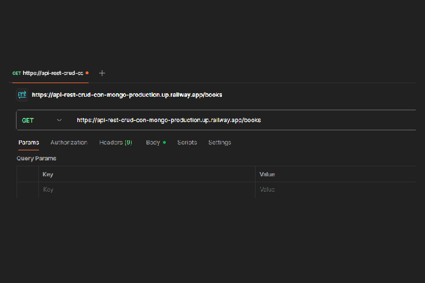
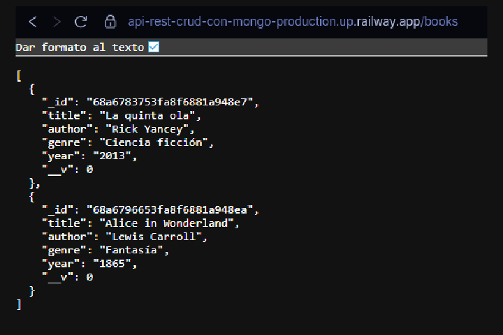
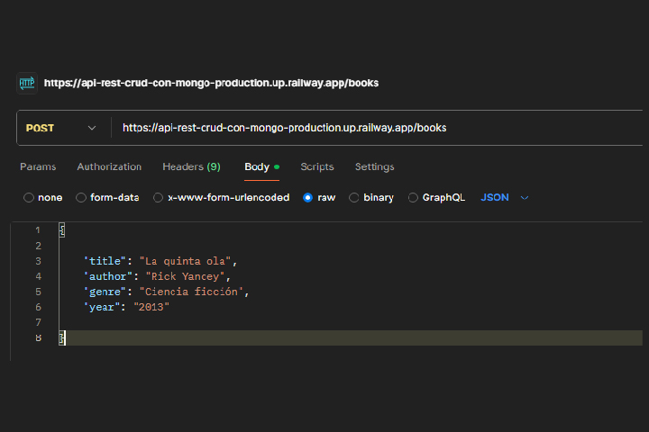
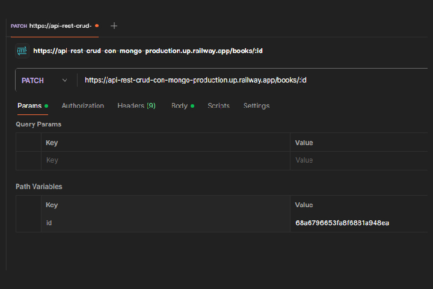
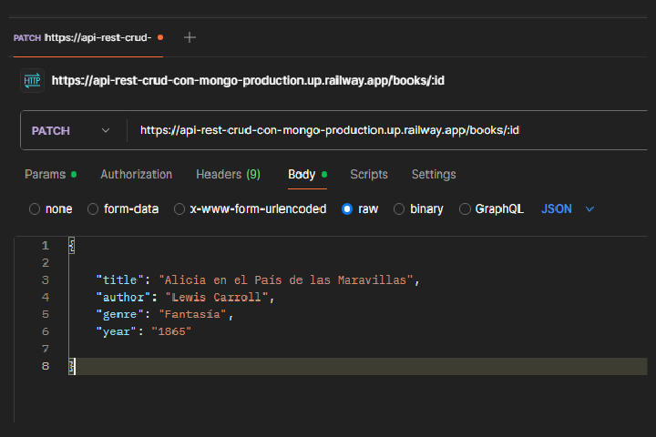
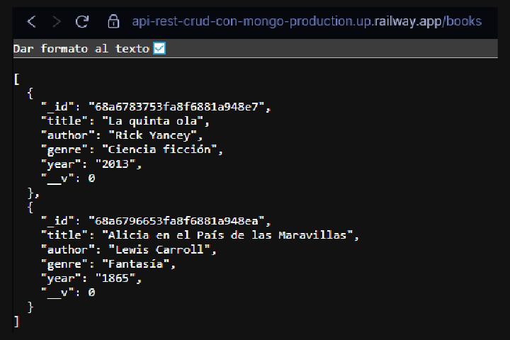
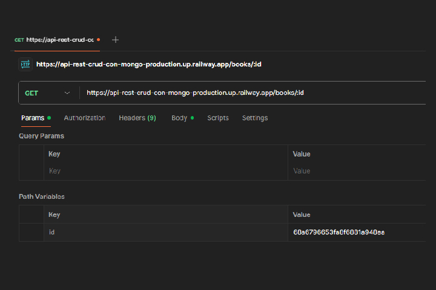

# API REST CRUD con Mongo

Práctica de un CRUD de libros utilizando **Node.js**, **Express** y **MongoDB**.  
Se probaron los endpoints con **Postman** y la base de datos se gestionó con **MongoDB Compass**.  
El proyecto incluye configuración para **Docker** y está desplegado en **Railway**.

## 🚀 Tecnologías usadas


## 🌐 Despliegue
👉 [Ver la API en Railway](https://api-rest-crud-con-mongo-production.up.railway.app/books)


## 📖 Endpoints principales

👉 Puedes probar el CRUD en Postman o en herramientas similares utilizando los siguientes endpoints:

📌 GET/POST → http://api-rest-crud-con-mongo-production.up.railway.app/books  
📌 GET/PUT/PATCH/DELETE → http://api-rest-crud-con-mongo-production.up.railway.app/books/:id  


### `GET /books` → Lista todos los libros
  
  


---

### `POST /books` → Crea un libro



⚠️ Nota: Para crear un libro, todos los campos (`title`, `author`, `genre`, `year`) son obligatorios. Si falta alguno, la API devuelve un mensaje de error.

---


### `PATCH /books/:id` → Actualiza parcialmente
 
 
  


---

### `PUT /books/:id` → Actualiza un libro

⚠️ Nota: Reemplazar `:id` por un ID válido de un libro existente. Todos los campos deben enviarse completos para actualizar correctamente.  
Ejemplo: `3720490020394`

---
### `GET /books/:id` → Busca un libro
  

---

### `DELETE /books/:id` → Elimina un libro
  


⚠️ Nota: Reemplazar `:id` por un ID válido de un libro existente. Si el `id` no existe, la API devolverá un error indicando que el libro no fue encontrado.
 

⚠️ Nota: Si el `id` no existe, la API devolverá un error indicando que el libro no fue encontrado.


## ⚙️ Instalación local
1. Clonar el repo  
   ```bash
   git clone https://github.com/Zombie5467/API-REST-CRUD-con-Mongo
   cd api-rest-crud-mongo


## 📝 Changelog

  

### v0.1 — 14/08/2025

- Corregido el error de Virtualization Al instalar Docker Desktop en mi pc.

  

- Corregida la importación de rutas: ahora se importa `router` desde `book.rutas.js` para evitar errores de middleware pero llame a la importación `bookRoutes` porque lo quise en plural porque pueden ser varias rutas.

- Corregida la conexión a MongoDB: se usa `MONGO_URL` del `.env` en lugar de `MONGO_DB_URL` para que Mongoose reciba la URI correcta.
 
[Ver detalles completos](./CHANGELOG.md)

----------
> Written with [StackEdit](https://stackedit.io/).